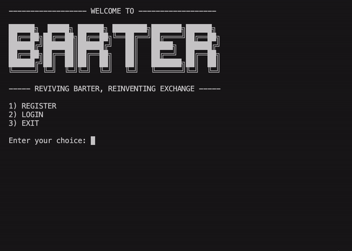
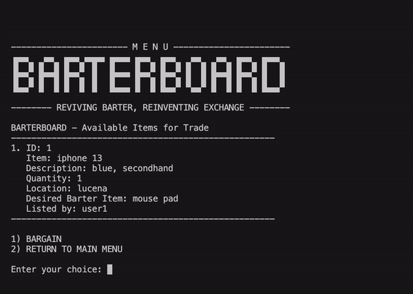
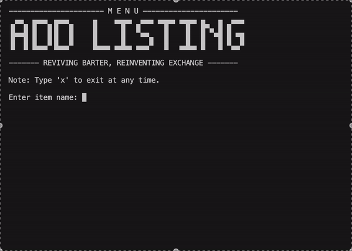
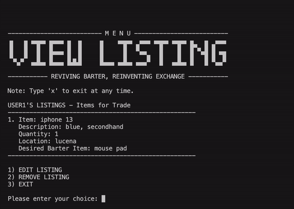
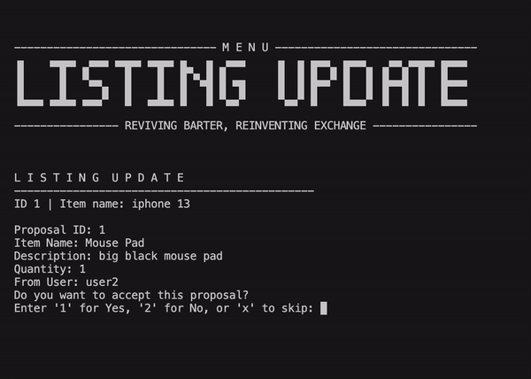
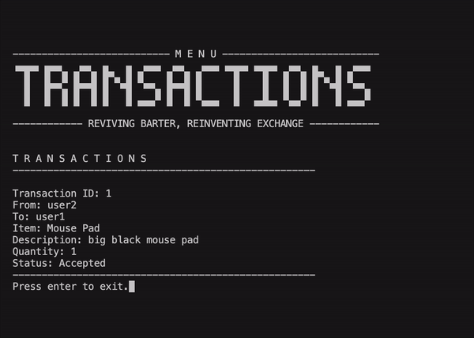

# **BarterBoard**  
**BarterBoard: Reviving Barter, Reinventing Exchange**  

  

## **Project Overview**  
BarterBoard is a Python-MySQL console application inspired by traditional barter systems, promoting sustainability through the cashless exchange of goods and services. It is designed to align with and support the following **Sustainable Development Goals (SDGs):**  

- **SDG 1: No Poverty**  
  Supporting equitable access to resources for everyone.  

- **SDG 11: Sustainable Cities and Communities**  
  Encouraging community collaboration and reducing waste through local exchanges.  

- **SDG 12: Responsible Consumption and Production**  
  Advocating for mindful resource use and minimizing environmental impact.  

- **SDG 8: Decent Work and Economic Growth**  
  Stimulating economic participation by enabling non-monetary trade opportunities.  

BarterBoard is inspired by the spirit of the barter tradition, creating and ensuring sustainable community development.  

## **Features**  
BarterBoard fosters resource sharing, waste reduction, and stronger communities by offering the following functionalities:  

| **Feature**         | **Description**                                                                 |
|----------------------|---------------------------------------------------------------------------------|
| **Register/Login**   | Create an account or log in to access personalized features and manage listings. |
| **BarterBoard**      | Explore all available items for trade and propose your own items in exchange.   |
| **Add Listings**     | Post new items for trade.                                                      |
| **View Listings**    | View your own items, with options to edit and remove them as needed.            |
| **Listing Update**   | Accept or reject trade proposals from other users.                             |
| **Transaction**      | View your completed exchanges to monitor your contributions.                   |

## **How It Works**  

###   
1. **Register and Login**:  
   Users create an account or log in to access BarterBoard features. The user database, including credentials and profile information, is securely stored in **barterboard.db** using MySQL.  
     
     

###   
2. **BarterBoard**:  
   The BarterBoard displays all available items for trade, each with detailed information including the listing ID, username of the lister, item name, description, quantity, location, and the desired item for trade. A **Bargain** option lets users propose a trade by selecting an item and sending a proposal to the listing owner.  
     

###   
3. **Add Listing**:  
   Users can add new listings by providing key details such as the item name, description, quantity, location, and the item they wish to receive in exchange. Each listing becomes available for others to view and bargain for on the BarterBoard.  
     

###   
4. **View Listing**:  
   Users can check their own listings to see all the items they have posted for trade. This section also allows them to edit or remove listing details as needed, keeping their profile updated and relevant.  
     

###   
5. **Listing Update**:  
   Users are notified when a proposal is received for one of their listings. They can choose to **accept**, **reject**, or **skip** the proposal. Accepted proposals move to the transaction phase, while rejected proposals are removed from the user's queue.  
     

### 
6. **Transaction**:  
   This section displays a history of all completed exchanges, providing users with a clear record of their contributions and trades. It helps users track their activity and fosters trust within the community.  
     

## **Prerequisites**  

You must have the following installed and set up before proceeding:  

- **Python 3.12.6** or later  
- **MySQL Server** and **MySQL Connector for Python** (use `pip install mysql-connector-python`)  
- **IDE or Terminal** (e.g., Visual Studio Code, PyCharm, or your preferred terminal)  
- **Git** (optional)  
- **GitHub Account** (optional)  

---

## **Installation**  

### **Clone the Repository**  

#### Option 1: Using Git (Git and GitHub Account Required)  
1. Open your terminal or launch Visual Studio Code.  
2. In the terminal or command palette (Ctrl+Shift+P on Windows, Command+Shift+P on Mac), type `Git: Clone` and select it.  
3. Copy and paste the following repository URL and press Enter:  
   ```bash
   https://github.com/jhonlloydval/BarterBoard.git
4. Choose a destination folder to clone the repository.
5.	Navigate to the cloned repository folder.

### Option 2: Download as ZIP
1.	Visit the repository’s GitHub page.
2.	Click on the Code button and select Download ZIP.
3.	Extract the downloaded ZIP file.
4.	Open the extracted folder in your IDE or terminal.

## **Sustainability Impact**  
By encouraging the reuse of resources and reducing waste, BarterBoard promotes sustainability while fostering a culture of sharing and collaboration. This innovative approach to exchanges ensures inclusivity, responsibility, and economic participation for all.  
# **BarterBoard and Sustainable Development Goals (SDGs)**

## **No Poverty (SDG 1):**
- **Empowering Communities**: Enables users to trade goods and services without money, helping those in need.
- **Access to Essentials**: Provides a platform for people to exchange resources, reducing financial barriers.

## **Zero Hunger (SDG 2):**
- **Redistribution of Goods**: Facilitates food and essentials exchange, contributing to food security.
- **Community Support**: Encourages local sharing of resources to combat hunger.

## **Sustainable Cities and Communities (SDG 11):**
- **Encouraging Sustainability**: Promotes reuse and recycling of goods, reducing waste and supporting sustainable cities.
- **Stronger Communities**: Fosters collaboration, building resilient, self-sufficient communities.

## **Responsible Consumption and Production (SDG 12):**
- **Minimizing Waste**: Reduces waste by encouraging the exchange of surplus items.
- **Sustainable Practices**: Promotes responsible consumption by facilitating the reuse of goods.

---
## **How BarterBoard Supports These Goals:**
- **User-Friendly**: Easy-to-use platform for exchanging goods and services.
- **Community-Driven**: Encourages local collaboration and sharing of resources.
- **Promotes Sustainability**: Focuses on reducing waste and supporting a circular economy.
---
